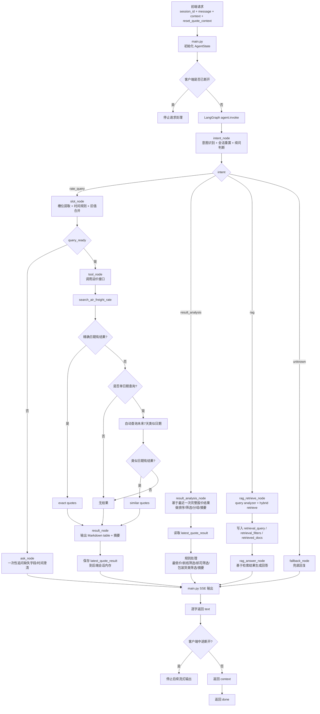

当前系统统一通过 `/api/chat` 入口处理 AI 运价查询、结果分析和 RAG 知识问答。下面是当前完整主链路总览。

```mermaid
flowchart TD
    A[前端请求<br/>session_id + message + context + reset_quote_context] --> B[main.py<br/>初始化 AgentState]
    B --> C{客户端是否已断开}
    C -- 是 --> C1[停止请求处理]
    C -- 否 --> D[LangGraph agent.invoke]

    D --> E[intent_node<br/>意图识别 + 会话重置 + 续问判断]

    E --> E1{intent}
    E1 -- rate_query --> S[slot_node<br/>槽位提取 + 时间规则 + 旧值合并]
    E1 -- result_analysis --> RA[result_analysis_node<br/>基于最近一次完整报价结果做排序/筛选/分组/摘要]
    E1 -- rag --> RR[rag_retrieve_node<br/>query analyzer + hybrid retrieve]
    E1 -- unknown --> F[fallback_node<br/>兜底回复]

    S --> S1{query_ready}
    S1 -- 否 --> ASK[ask_node<br/>一次性追问缺失字段/时间澄清]
    S1 -- 是 --> T[tool_node<br/>调用运价接口]

    T --> T1[search_air_freight_rate]
    T1 --> T2{精确日期有结果?}
    T2 -- 是 --> T3[exact quotes]
    T2 -- 否 --> T4{是否单日期查询?}
    T4 -- 否 --> T5[无结果]
    T4 -- 是 --> T6[自动查询未来7天类似日期]
    T6 --> T7{类似日期有结果?}
    T7 -- 是 --> T8[similar quotes]
    T7 -- 否 --> T5

    T3 --> R[result_node<br/>输出 Markdown table + 摘要]
    T8 --> R
    T5 --> R

    R --> STORE[保存 latest_quote_result<br/>到后端会话内存]

    RA --> RA1[读取 latest_quote_result]
    RA1 --> RA2[规则处理<br/>最低价/航线筛选/航司筛选/包装货类筛选/摘要]

    RR --> RR1[写入 retrieval_query / retrieval_filters / retrieved_docs]
    RR1 --> RG[rag_answer_node<br/>基于检索结果生成回答]

    ASK --> OUT
    F --> OUT
    STORE --> OUT
    RA2 --> OUT
    RG --> OUT

    OUT[main.py SSE 输出]
    OUT --> OUT1[逐字返回 text]
    OUT1 --> OUT2{客户端中途断开?}
    OUT2 -- 是 --> STOP[停止后续流式输出]
    OUT2 -- 否 --> OUT3[返回 context]
    OUT3 --> OUT4[返回 done]
```
