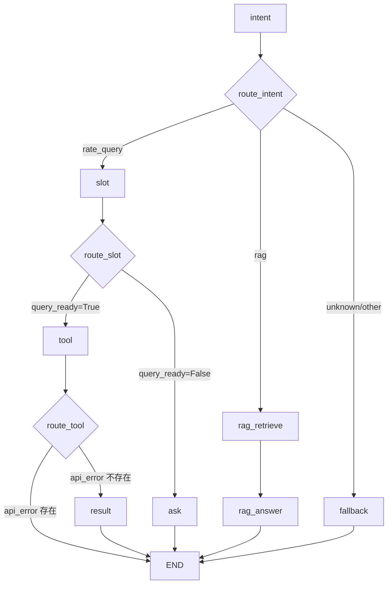
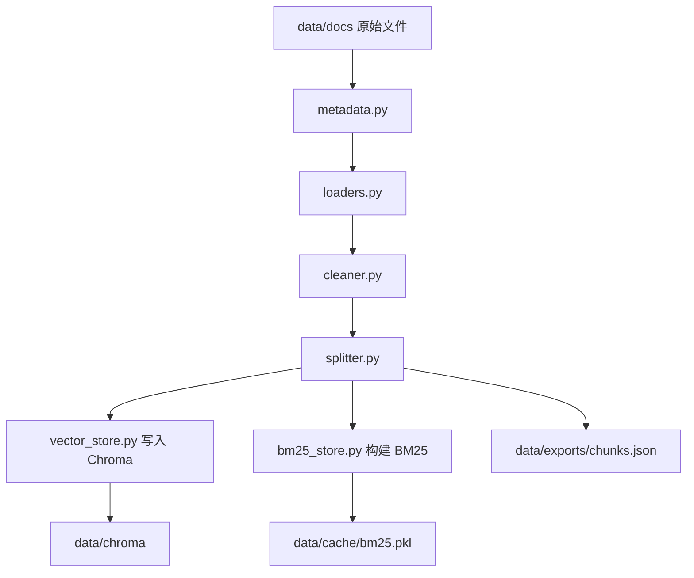
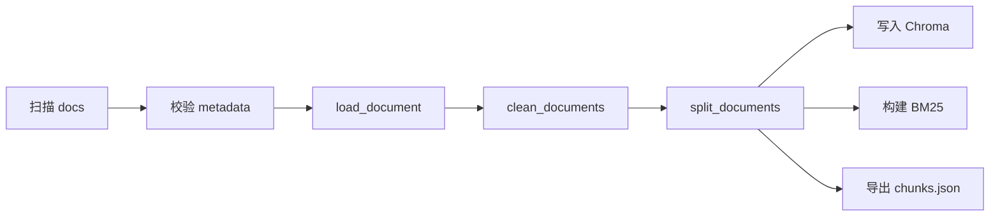
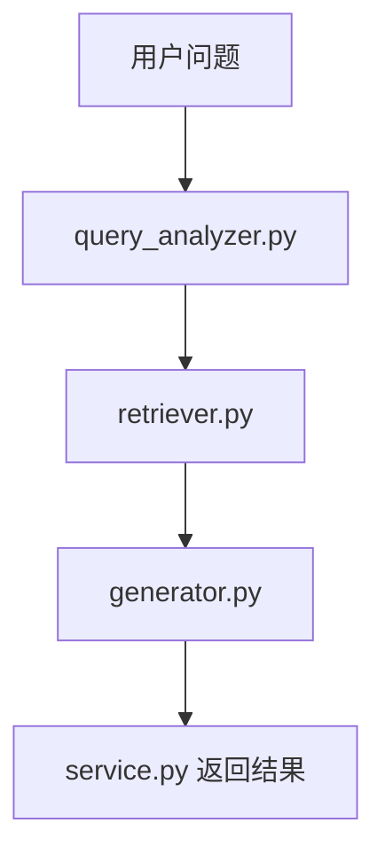
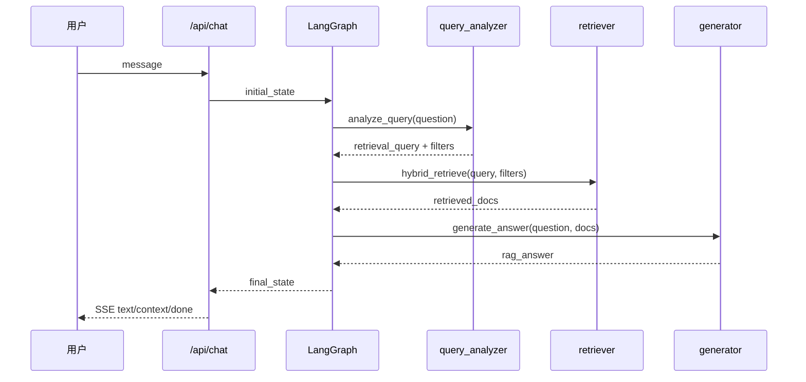

# RAG 模块说明

## 1. 文档目标

这份文档用于解释当前项目中 `rag/` 模块的完整实现思路、模块职责、调用关系和数据流，方便你后续：

- 阅读代码时快速建立整体认知
- 定位问题时知道该看哪一层
- 调整 Prompt、metadata、检索策略时不误伤现有运价查询链路

当前实现遵守以下边界：

- 不修改 `/api/chat` 的请求结构
- 不修改 SSE 返回协议
- 不破坏已有运价查询链路
- RAG Prompt 单独集中在 `rag/prompts.py`
- 运价 Prompt 继续留在 `graph/prompts.py`

---

## 2. 整体目标

项目要处理三类问题：

1. 运价查询
2. 业务知识问答
3. 无关或无法识别的问题

其中：

- 运价查询继续走原有 `rate_query` 链路
- 业务知识问答走新增 RAG 链路
- 无关问题继续走 `fallback`

因此系统内部现在是一个统一 Agent，根据 `intent` 自动路由。

---

## 3. 总体架构

### 3.1 对外接口

对外接口没有变化：

- `GET /health`
- `POST /api/chat`

`/api/chat` 仍然返回 SSE，事件类型仍然只有：

- `text`
- `context`
- `done`
- `error`

RAG 接入只发生在服务内部，不改变前端协议。

### 3.2 内部路由



---

## 4. 目录与模块职责

当前 RAG 相关实现分成三层：

1. `rag/`：RAG 业务模块本体
2. `graph/`：把 RAG 接到 LangGraph
3. `scripts/`：知识库初始化、重建、调试入口

### 4.1 `rag/` 目录

| 文件 | 职责 |
|------|------|
| `rag/__init__.py` | 对外统一导出 `query_knowledge_base / build_knowledge_base / rebuild_knowledge_base` |
| `rag/prompts.py` | RAG Prompt 集中管理 |
| `rag/metadata.py` | 8 份业务文件 metadata 配置与校验 |
| `rag/loaders.py` | PDF / DOCX / PPTX / DOC 文档解析 |
| `rag/cleaner.py` | 轻量文本清洗 |
| `rag/splitter.py` | 文档切 chunk |
| `rag/embeddings.py` | 百炼 embedding 封装 |
| `rag/vector_store.py` | Chroma 读写与向量检索 |
| `rag/bm25_store.py` | BM25 索引和关键词检索 |
| `rag/indexer.py` | 离线建库主流程 |
| `rag/query_analyzer.py` | 用户问题 -> 检索 query + metadata filter |
| `rag/retriever.py` | 向量 + BM25 混合召回 |
| `rag/reranker.py` | 预留重排接口 |
| `rag/generator.py` | 基于检索片段生成回答 |
| `rag/service.py` | 在线 RAG 编排入口 |

### 4.2 `graph/` 中和 RAG 直接相关的文件

| 文件 | 职责 |
|------|------|
| `graph/state.py` | 扩展 RAG 状态字段 |
| `graph/nodes.py` | 新增 `rag_retrieve_node`、`rag_answer_node` |
| `graph/agent.py` | 将 `intent=rag` 路由到 RAG 链路 |

### 4.3 `scripts/`

| 文件 | 职责 |
|------|------|
| `scripts/init_kb.py` | 初始化知识库 |
| `scripts/rebuild_kb.py` | 重建知识库 |
| `scripts/test_rag.py` | 本地手工测试 RAG 问答 |

---

## 5. 两条主链路

RAG 实际上有两条链路：

1. 离线建库链路
2. 在线问答链路

这两条链路共享同一套 metadata 和 chunk 结构。

---

## 6. 离线建库链路

### 6.1 流程图



### 6.2 `metadata.py`

这是整个 RAG 精度的基础层。

它的职责不是解析内容，而是给每一份原始文件打业务标签，例如：

- `category`
- `sub_category`
- `doc_type`
- `applicable_to`
- `keywords`
- `is_form`
- `port`
- `version`

为什么它重要：

- 用户问“ACCOS 分单件数”，应该优先查 `operations`
- 用户问“锂电池声明”，应该优先查 `dangerous_goods`
- 用户问“普货不带电委托书”，应该优先查 `general_cargo`

如果没有 metadata，系统只能裸搜，8 份资料会互相污染。

### 6.3 `loaders.py`

作用：把不同格式文件统一读成标准结构。

输出结构统一成：

```python
[
    {
        "page_content": "...",
        "metadata": {
            "source_file": "...",
            "page": 1,
            "slide": None,
            "source_type": "pdf"
        }
    }
]
```

当前支持：

- PDF：按页读取
- DOCX：读取段落和表格
- PPTX：按页读取文本框
- DOC：通过 Windows + Word COM 读取

### 6.4 为什么 `.doc` 要单独处理

实际资料里有 4 份旧版 `.doc` 文件，不是 `.docx`。

这意味着：

- `python-docx` 无法直接读取
- 如果不处理，这 4 份文件无法建库

当前实现采用最小可行方案：

- 依赖 `pywin32`
- 依赖本机安装 Microsoft Word
- 使用 COM 打开 `.doc` 并导出正文文本

这不是最理想方案，但在现有文件前提下是最直接可落地的方案。

### 6.5 `cleaner.py`

作用：轻量清洗文本，降低脏数据影响。

当前做的事情：

- 合并多余空白
- 去掉空行
- 去掉明显页码噪声，如“第 1 页”“Page 2”

注意：这里没有做内容改写。

原因是项目文档里有很多：

- 声明
- 授权委托书
- 检查单

这类资料不能随意改写，否则会影响业务含义。

### 6.6 `splitter.py`

作用：把长文档切成适合向量检索的 chunk。

实现方式：

- 使用 `RecursiveCharacterTextSplitter`
- 从配置读取 `chunk_size` 和 `chunk_overlap`

当前 chunk 会补充这些字段：

- `chunk_index`
- `chunk_size`
- `content_hash`
- `source_file`
- `source_type`
- `category`
- `sub_category`
- `doc_type`
- `is_form`

这些字段后续分别用于：

- 去重
- 追踪来源
- 增量更新
- metadata filter

### 6.7 `embeddings.py`

作用：封装百炼 embedding。

暴露两个接口：

- `embed_documents(texts)`
- `embed_query(text)`

同时提供 `DashScopeEmbeddings` 适配器，专门给 Chroma/LangChain 用。

这样做的好处是：

- 上层不需要关心底层 HTTP 请求细节
- 后续如果换 embedding 模型，只改这一层

### 6.8 `vector_store.py`

作用：负责 Chroma 的初始化、写入、删除和向量检索。

关键点：

- collection 固定为配置中的 `freight_knowledge`
- 使用 `source_file::chunk_index` 作为稳定 ID
- 支持 `delete_by_source_file`
- 支持 `similarity_search(query, k, filters)`

为什么有 `delete_by_source_file`：

因为建库更新采用“先删后加”，避免同一文档重复写入。

### 6.9 `bm25_store.py`

作用：负责关键词检索。

为什么需要它：

有些词是强关键词，BM25 比向量更稳，例如：

- `ACCOS`
- `PI967`
- `PI968`
- `分单件数`
- `授权委托书`
- `品名清单`

当前实现：

- 从 chunk 构建 BM25 语料
- 落盘到 `data/cache/bm25.pkl`
- 检索时支持 metadata filter

### 6.10 `indexer.py`

这是离线建库的总编排入口。

核心流程：



它提供三个主要能力：

- `index_document(filepath, metadata)`
- `build_knowledge_base()`
- `rebuild_knowledge_base()`

两者区别：

- `build_knowledge_base`：正常构建
- `rebuild_knowledge_base`：删除旧索引后全量重建

当前第一版明确优先稳定性，所以 `rebuild` 采用全量重建，而不是复杂增量更新。

---

## 7. 在线问答链路

### 7.1 流程图



### 7.2 `query_analyzer.py`

作用：把自然语言问题转换成结构化检索请求。

输出结构：

```python
{
    "query": "适合检索的关键词串",
    "filters": {
        "category": "dangerous_goods"
    }
}
```

当前采用两段式：

1. 规则优先
2. LLM 补充

规则优先的原因：

- 当前知识库只有 8 份文件
- 业务边界比较明确
- 规则更稳定、更可控、更好排障

例如：

- 包含“锂电池/危险品/PI967/PI968” -> `dangerous_goods`
- 包含“ACCOS/分单/件数/录入” -> `operations`
- 包含“普货/不带电/委托书” -> `general_cargo`
- 包含“报关/品名清单/上海口岸/清关” -> `customs`

当规则无法覆盖时，再调用 LLM 输出 JSON。

### 7.3 `retriever.py`

作用：实现 Hybrid Retrieval。

内部步骤：

1. 向量检索 TopK
2. BM25 检索 TopK
3. 去重
4. 融合排序
5. 可选 rerank

当前的融合规则是第一版简化方案：

- 向量分数用 Chroma 返回的 distance
- BM25 分数越大越相关
- 用一个简单排序公式合并

后续如果效果不理想，再考虑：

- 分数归一化
- Reciprocal Rank Fusion
- Cross-Encoder reranker

### 7.4 为什么要有 filter 失败回退

如果 `query_analyzer` 把问题判错分类，带 filter 检索可能直接空结果。

例如：

- 用户其实问锂电池
- 规则或 LLM 错误判成 `general_cargo`

如果不做兜底，就会直接回答“没找到”。

所以当前实现里：

- 如果带 filter 检索完全无结果
- 自动退回无 filter 再检一次

这样即使 filter 错了，也还有一次召回机会。

### 7.5 `reranker.py`

当前是预留接口：

```python
def rerank(query: str, docs: list[dict]) -> list[dict]:
    return docs
```

用途是给第二阶段优化留扩展点，第一版默认不开。

### 7.6 `generator.py`

作用：把检索到的 chunk 组织成上下文，交给 DeepSeek 生成最终中文回答。

它做了两件关键事：

1. 把 chunk 和来源信息一起格式化
2. 用 system prompt 明确限制“只能依据资料回答”

如果没有检索结果，直接返回：

`当前资料中未检索到明确依据，建议联系业务同事进一步确认。`

### 7.7 `service.py`

作用：作为对外统一编排入口。

它把整个链路串起来：

```python
question
 -> analyze_query
 -> hybrid_retrieve
 -> generate_answer
 -> return
```

当前提供两个接口：

- `run_rag_pipeline(question)`：返回中间状态 + 最终答案
- `query_knowledge_base(question)`：只返回答案

`run_rag_pipeline` 的价值在于调试。

它返回：

- `retrieval_query`
- `retrieval_filters`
- `retrieved_docs`
- `rag_answer`

这正好对应问题排查的关键观察点。

---

## 8. LangGraph 如何接入 RAG

### 8.1 `graph/state.py`

新增了这些 RAG 状态字段：

- `rag_query`
- `retrieval_query`
- `retrieval_filters`
- `retrieved_docs`
- `rag_answer`

这些字段的目的不是前端展示，而是：

- 保证检索过程可观察
- 方便排查检索错误
- 避免和运价链路里的 `api_result` 混在一起

### 8.2 `graph/nodes.py`

新增两个节点：

#### `rag_retrieve_node`

职责：

- 取用户最新问题
- 调 `analyze_query`
- 调 `hybrid_retrieve`
- 把检索中间结果写入 state

#### `rag_answer_node`

职责：

- 取 `retrieved_docs`
- 调 `generate_answer`
- 把回答写入 `messages`

为什么拆成两个节点，而不是一个节点做完：

- 更容易调试
- 更容易打印中间状态
- 后续如果要展示引用或打日志，也更清晰

### 8.3 `graph/agent.py`

这里最大的变化是：

以前：

- `intent == rate_query` -> `slot`
- 其他 -> `fallback`

现在：

- `intent == rate_query` -> `slot`
- `intent == rag` -> `rag_retrieve`
- `intent == unknown` -> `fallback`

这意味着 RAG 已经从“建设中兜底”变成真实可执行链路。

---

## 9. 主接口为什么没有改

`main.py` 只做了一件与 RAG 相关的事情：

- 初始化 RAG 状态字段

但它没有改这些内容：

- 请求体字段
- SSE 返回结构
- `context` 返回格式

原因是项目要求很明确：

- 前端已经依赖当前协议
- 运价查询链路已经跑通
- RAG 接入不能影响前端对接方式

因此我们选择：

- 在 LangGraph 内部扩能力
- 对外接口保持不变

---

## 10. 状态流转说明

### 10.1 在线 RAG 状态流



### 10.2 关键状态字段含义

| 字段 | 含义 |
|------|------|
| `rag_query` | 用户原始问题 |
| `retrieval_query` | 分析后用于检索的 query |
| `retrieval_filters` | metadata 过滤条件 |
| `retrieved_docs` | 最终召回的文档片段 |
| `rag_answer` | 生成好的最终回答 |

---

## 11. 配置项如何影响 RAG

这些配置在 `config.py` 中统一管理：

| 配置项 | 作用 |
|------|------|
| `dashscope_api_key` | 调用百炼 embedding |
| `embedding_model` | embedding 模型名 |
| `chroma_persist_dir` | Chroma 持久化目录 |
| `chroma_collection_name` | collection 名 |
| `rag_top_k_vector` | 向量召回数量 |
| `rag_top_k_bm25` | BM25 召回数量 |
| `rag_top_k_final` | 最终保留文档数 |
| `rag_chunk_size` | chunk 大小 |
| `rag_chunk_overlap` | chunk 重叠 |
| `rag_enable_rerank` | 是否启用重排 |
| `rag_docs_dir` | 原始业务文件目录 |

这样做的目的：

- 不把阈值和路径硬编码到业务代码里
- 后续调参只改配置

---

## 12. 当前已实现的最小闭环

当前 RAG 已经具备：

- metadata 管理
- 多格式文档解析
- 轻量清洗
- chunk 切分
- embedding 封装
- Chroma 持久化
- BM25 检索
- query analyzer
- hybrid retrieval
- 基于资料回答
- LangGraph 路由接入

也就是说，结构上已经不是占位，而是一条完整链路。

---

## 13. 当前限制与风险

### 13.1 `.doc` 依赖 Microsoft Word

这是当前最大的工程风险。

如果部署机没有 Word：

- `.doc` 文件无法解析
- 建库流程会失败

### 13.2 真正的端到端效果还依赖真实环境

需要这些条件都满足：

- 安装新增依赖
- 有 `DASHSCOPE_API_KEY`
- 有 `DEEPSEEK_API_KEY`
- Chroma 可正常落盘
- BM25 索引可正常生成

### 13.3 检索融合策略是第一版简化实现

当前重点是：

- 先跑通
- 先可调试
- 先不破坏原链路

如果后续要进一步优化准确率，可以继续做：

- 更细粒度 metadata
- 更好的中文分词
- 更严谨的分数融合
- reranker
- chunk 质量调优

---

## 14. 推荐阅读顺序

如果你想从代码角度理解，我建议按这个顺序看：

1. `rag/metadata.py`
2. `rag/loaders.py`
3. `rag/indexer.py`
4. `rag/query_analyzer.py`
5. `rag/retriever.py`
6. `rag/generator.py`
7. `rag/service.py`
8. `graph/nodes.py`
9. `graph/agent.py`

这个顺序的原因是：

- 先理解“知识怎么进库”
- 再理解“问题怎么出答案”
- 最后理解“怎么接到主 Agent”

### 14.1 逐文件阅读手册

下面这版更细，适合你边看代码边建立完整脑图。

#### 第一组：先看“边界”和“入口”

1. `config.py`
2. `rag/__init__.py`
3. `graph/state.py`

先看这三个文件，是为了先搞清楚：

- RAG 用了哪些配置
- 对外暴露了哪些能力
- AgentState 里有哪些 RAG 中间状态

如果这一步不先看，后面看到 `retrieval_query`、`retrieved_docs`、`rag_answer` 会比较跳。

#### 第二组：再看“知识如何进库”

4. `rag/metadata.py`
5. `rag/loaders.py`
6. `rag/cleaner.py`
7. `rag/splitter.py`
8. `rag/embeddings.py`
9. `rag/vector_store.py`
10. `rag/bm25_store.py`
11. `rag/indexer.py`

这一组回答的问题是：

- 原始文件如何被识别
- 不同格式如何被读成统一结构
- 文本如何清洗
- 文档如何切成 chunk
- chunk 如何写入 Chroma
- BM25 索引如何落盘
- build / rebuild 到底做了什么

建议阅读方式：

- 先看 `metadata.py`，理解“业务标签”
- 再看 `loaders.py`，理解“文档读法”
- 再看 `splitter.py`，理解“chunk 长什么样”
- 最后看 `indexer.py`，把前面这些串起来

#### 第三组：再看“问题如何变成检索”

12. `rag/prompts.py`
13. `rag/query_analyzer.py`
14. `rag/retriever.py`
15. `rag/reranker.py`

这一组回答的问题是：

- 用户问题如何被改写成检索 query
- metadata filter 从哪里来
- 为什么不是只做向量检索
- 为什么 filter 失败要回退到无 filter

建议重点看：

- `query_analyzer.py` 里的规则优先逻辑
- `retriever.py` 里的向量/BM25 合并逻辑

#### 第四组：最后看“答案如何生成并接入主 Agent”

16. `rag/generator.py`
17. `rag/service.py`
18. `graph/nodes.py`
19. `graph/agent.py`
20. `main.py`

这一组回答的问题是：

- 检索结果如何喂给 DeepSeek
- 为什么 service 只做编排
- 为什么 RAG 在图里拆成两个节点
- 最终怎么回到 `/api/chat`
- 为什么 SSE 协议没有变化

建议重点看：

- `rag/service.py`：理解在线总编排
- `graph/nodes.py`：理解 RAG 怎么挂到 LangGraph
- `main.py`：确认外部接口保持不变

### 14.2 快速阅读版本

如果你时间很少，只想在 10 分钟内建立全貌，建议只看这 6 个文件：

1. `rag/metadata.py`
2. `rag/indexer.py`
3. `rag/query_analyzer.py`
4. `rag/retriever.py`
5. `rag/service.py`
6. `graph/nodes.py`

这 6 个文件已经覆盖了：

- 文件分类
- 建库主流程
- 查询分析
- 检索召回
- 在线编排
- LangGraph 接入

---

## 15. 调试手册

这一节不讲“设计”，只讲“出了问题怎么查”。

### 15.1 先确定是离线问题还是在线问题

先问自己一个问题：

> 问题出在“知识没进库”，还是“知识进库了但没搜到/没答对”？

可以按这个思路分：

- `scripts/init_kb.py` / `scripts/rebuild_kb.py` 跑不通：离线建库问题
- 能建库，但问答答不出来：在线检索或生成问题
- `intent=rag` 仍然没进 RAG：图路由问题

### 15.2 调试顺序建议

推荐固定按下面顺序查，不要一上来就怀疑大模型：

1. 文档文件是否齐全
2. metadata 是否齐全
3. loader 是否能读出内容
4. cleaner/splitter 后 chunk 是否合理
5. Chroma 是否写入成功
6. BM25 索引是否生成
7. query_analyzer 是否产出了正确 filter
8. retriever 是否真正召回了正确 chunk
9. generator 是否基于这些 chunk 正常回答
10. graph 是否把 `intent=rag` 路由到了 RAG 节点

### 15.3 常见问题定位表

| 现象 | 优先检查位置 | 常见原因 |
|------|------|------|
| `scripts/init_kb.py` 直接失败 | `rag/metadata.py` / `rag/loaders.py` | 缺 metadata、文件格式不支持、`.doc` 无法解析 |
| 建库成功但回答总是“未检索到明确依据” | `rag/query_analyzer.py` / `rag/retriever.py` | filter 过窄、query 不合理、chunk 质量差 |
| 回答内容明显串题 | `rag/metadata.py` / `rag/retriever.py` | metadata 分类不准、filter 没起作用 |
| 明明能搜到资料但回答不准确 | `rag/generator.py` / `rag/prompts.py` | 生成 Prompt 约束不够、上下文组织方式不理想 |
| 用户问业务问题却走了 fallback | `graph/prompts.py` / `graph/agent.py` | intent 分类成了 `unknown`，没有被识别为 `rag` |
| 构建知识库时 `.doc` 报错 | `rag/loaders.py` | 本机没装 Word 或没装 `pywin32` |

### 15.4 离线建库调试

#### 步骤 1：确认 docs 目录

先确认 `data/docs/` 下文件确实齐全，且文件名没有被手工改过。

因为 `metadata.py` 是按文件名精确匹配的：

- 文件名变了
- metadata 没同步

就会直接校验失败。

#### 步骤 2：跑初始化脚本

```bash
python scripts/init_kb.py
```

如果这里失败，优先看：

- 报错是不是 metadata 缺失
- 报错是不是 `.doc` 解析失败
- 报错是不是 embedding 接口失败

#### 步骤 3：看 `data/exports/chunks.json`

这个文件是最有价值的离线排障产物。

重点看三件事：

1. chunk 是否真的切出来了
2. chunk 文本是否可读
3. metadata 是否继承完整

如果这里就不对，后面的检索一定不准。

#### 步骤 4：看 BM25 缓存是否生成

检查：

- `data/cache/bm25.pkl` 是否存在

不存在说明 BM25 没建成。

#### 步骤 5：看 Chroma 目录是否生成

检查：

- `data/chroma/` 是否生成内容

如果 BM25 有，但 Chroma 没有，说明问题在向量写入链路。

### 15.5 在线问答调试

#### 步骤 1：先单独跑 service

可以直接用：

```bash
python scripts/test_rag.py
```

这是最小化在线链路测试：

- 不经过前端
- 不经过 SSE
- 直接测试 `query_knowledge_base`

如果这里都答不出来，先不要去查 `/api/chat`。

#### 步骤 2：重点观察 4 个中间状态

在线 RAG 最关键的 4 个观察点是：

- `retrieval_query`
- `retrieval_filters`
- `retrieved_docs`
- `rag_answer`

排障思路：

- `retrieval_query` 不对：看 `query_analyzer.py`
- `retrieval_filters` 不对：看规则或 LLM 输出
- `retrieved_docs` 不对：看 `retriever.py`
- `rag_answer` 不对：看 `generator.py`

#### 步骤 3：如何判断是“没搜到”还是“答偏了”

很简单：

- `retrieved_docs` 为空或明显无关：这是检索问题
- `retrieved_docs` 是对的，但 `rag_answer` 偏了：这是生成问题

这也是为什么图里必须拆成：

- `rag_retrieve_node`
- `rag_answer_node`

### 15.6 图路由调试

如果用户问明显的业务问题，却没有进入 RAG，优先查：

1. `graph/prompts.py` 的意图识别 Prompt
2. `graph/nodes.py` 的 `intent_node`
3. `graph/agent.py` 的 `route_intent`

判断方法：

- 如果 `intent_node` 输出不是 `rag`，问题在意图识别
- 如果已经是 `rag`，但没走 `rag_retrieve`，问题在路由

### 15.7 推荐的调试命令

#### 静态编译检查

```bash
python -m compileall rag graph scripts tests main.py config.py
```

#### 运行基础单元测试

```bash
python -m unittest tests.test_rag_query_analyzer tests.test_rag_cleaner tests.test_rag_service
```

#### 初始化知识库

```bash
python scripts/init_kb.py
```

#### 重建知识库

```bash
python scripts/rebuild_kb.py
```

#### 本地测试 RAG

```bash
python scripts/test_rag.py
```

### 15.8 调试时优先看的文件

遇到问题时，不要全项目乱翻，优先按问题类型看：

#### 建库失败

- `rag/metadata.py`
- `rag/loaders.py`
- `rag/indexer.py`

#### 检索不准

- `rag/query_analyzer.py`
- `rag/retriever.py`
- `rag/metadata.py`

#### 回答不准

- `rag/generator.py`
- `rag/prompts.py`

#### 没进入 RAG

- `graph/prompts.py`
- `graph/nodes.py`
- `graph/agent.py`

### 15.9 建议你实际阅读时这样做

最省时间的方式不是先看所有代码，而是：

1. 先读一遍本文件
2. 跑一次 `python scripts/init_kb.py`
3. 看一眼 `data/exports/chunks.json`
4. 再跑 `python scripts/test_rag.py`
5. 最后回头看 `query_analyzer.py`、`retriever.py`、`generator.py`

这样你看到的不是抽象设计，而是“输入 -> 中间产物 -> 输出”的完整链路。

---

## 16. 一句话总结

当前 RAG 的设计是：

**用 metadata 控制检索边界，用 Chroma + BM25 做混合召回，用 DeepSeek 基于检索片段生成答案，并通过 LangGraph 在不改 `/api/chat` 协议的前提下接入现有 AI 运价 Agent。**
