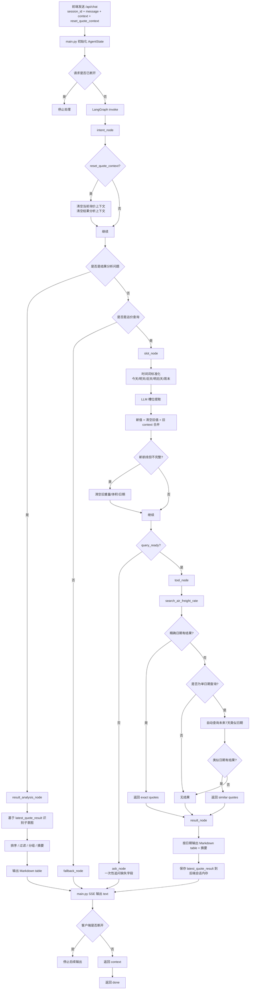

# AI 运价系统详细说明手册

## 文档创建时间
2026-05-14

## 文档目标

本文档只回顾当前 **AI 运价查询系统**，不包含 RAG。

目标有 4 个：

1. 建立当前系统的全局认知
2. 解释每个环节是如何处理的
3. 对照 [RequestQuotation.md](D:\CompanyPlace\AIProject\AiFreightRate\freight-agent\docs\RequestQuotation.md) 梳理 A 类问题当前是如何解决的
4. 提炼一套后续解决类似问题的思维方式

---

## 一句话总览

当前系统已经从“只会查价”演进成了一个带有**状态管理、追问补参、工具调用、结果标准化、结果二次分析、请求生命周期控制**的 AI 运价 Agent。

它解决的问题不只是：

- 有没有价格

还包括：

- 缺参数时怎么追问
- 同一会话里怎么继续改参数
- 查完结果后怎么继续问“最便宜”“直达有哪些”“某航司有没有”
- 用户取消请求或结束本轮会话时，后端如何止损和重置

---

## 1. 当前系统边界

这部分直接继承 [RequestQuotation.md](D:\CompanyPlace\AIProject\AiFreightRate\freight-agent\docs\RequestQuotation.md) 的定义，并结合当前实现落地。

### 1.1 当前已具备的能力

- 只有一个运价查询接口
- 统一通过 `/api/chat` 入口处理
- 支持多轮追问补齐必填字段
- 支持基于已返回报价结果继续做二次处理
- 精确日期无数据时，自动查未来 7 天类似日期数据
- SSE 流式返回文本
- 返回 `context` 给前端缓存

### 1.2 当前可用的核心返回字段

- 航司
- 航线
- 货类
- 包装
- 预估运费单价
- 预估运费总价
- 预估卡车费
- 合计

### 1.3 当前系统的本质能力边界

当前系统能做的，是：

- 先查出一批原始报价结果
- 再对这批结果做排序、筛选、分组、摘要

当前系统暂时不能天然做的，是：

- 时效判断
- 舱位判断
- 稳定性判断
- 趋势分析
- 附加费完整拆分

也就是说：

**当前系统已经从“接口查询器”进化成“报价结果处理器”，但还不是“完整业务决策系统”。**

---

## 2. 当前系统整体架构

### 2.1 外部协议

对外仍然只有一个主接口：

```text
POST /api/chat
```

请求核心字段：

- `session_id`
- `message`
- `context`
- `reset_quote_context`

响应仍是 SSE，事件类型保持不变：

- `text`
- `context`
- `done`
- `error`

### 2.2 当前系统的两条运价主链

当前 AI 运价内部其实有两条主链：

1. 查询链
2. 结果分析链

#### 查询链
负责：

- 识别这是不是一条新的运价查询
- 抽取参数
- 补齐参数
- 调接口查价
- 格式化输出结果

#### 结果分析链
负责：

- 用户已经完成一次完整查价后
- 围绕那批结果继续问
- 不重新查接口
- 直接基于上一批结果做处理后返回

例如：

- 最便宜的是哪个
- 直达有哪些
- CZ 有价格吗
- 散货有哪些
- 帮我总结一下

---

## 3. 当前系统的关键处理环节

## 3.1 请求进入

入口文件是 [main.py](D:\CompanyPlace\AIProject\AiFreightRate\freight-agent\main.py)。

它做的事：

1. 接收前端请求
2. 恢复前端传回来的 `context`
3. 恢复后端按 `session_id` 保存的最近一次完整报价结果
4. 初始化 `AgentState`
5. 调 `agent.invoke`
6. 把最终 AI 回复按字符流式输出
7. 再把最新 `context` 返回给前端

### 这里解决了什么问题

- 支持多轮补参
- 支持结果分析链依赖后端内存态
- 支持结束本轮会话时只清上下文、不清聊天记录
- 支持前端取消请求后，后端尽快停止无意义输出

### 关联知识点

#### LangGraph

- 状态图执行入口
- `invoke(state)` 方式运行图

#### LangChain

- `HumanMessage` / `AIMessage` 消息对象

#### 工程知识点

- SSE 流式输出
- 会话状态与展示状态分离
- 请求取消检测

---

## 3.2 状态建模

状态定义在 [graph/state.py](D:\CompanyPlace\AIProject\AiFreightRate\freight-agent\graph\state.py)。

当前状态可分成 4 类：

### A. 查询槽位状态

- `sfg`
- `mdg`
- `inputWeight`
- `inputVol`
- `hbrq`
- `hbrqBegin`
- `hbrqEnd`
- `flightType`
- `packageType`
- `cargoType`
- `twoCode`
- `gid`

### B. 查询控制状态

- `missing_slots`
- `query_ready`
- `query_completed`
- `reset_quote_context`
- `current_beijing_date`
- `time_clarify_message`

### C. 查询结果状态

- `api_result`
- `api_error`

### D. 结果分析状态

- `quote_result_active`
- `latest_quote_result`
- `result_analysis_intent`
- `result_analysis_filters`

### 为什么这一步很重要

这是整个系统从“普通聊天机器人”变成“业务 Agent”的关键。

没有这一步，系统只能：

- 看当前一句话
- 给当前一句话回复

有了这一步之后，系统才能：

- 记住上一轮缺了什么
- 记住上一轮查到了什么
- 知道现在是在继续查，还是在继续分析结果

### 关联知识点

#### LangGraph

- `TypedDict` 状态建模
- 节点间共享状态
- 条件路由依赖状态字段

---

## 3.3 意图识别

意图识别在 [graph/nodes.py](D:\CompanyPlace\AIProject\AiFreightRate\freight-agent\graph\nodes.py) 的 `intent_node`。

当前它不只是做“分类”，还做了几件非常关键的事：

1. 处理 `reset_quote_context`
2. 识别是否是新的完整询价
3. 识别是否是承接上文的继续报价
4. 识别是否是“围绕上一批结果继续分析”
5. 对剩余情况再调用大模型做 `rate_query / rag / unknown`

### 这里的核心设计不是“全靠提示词”

当前意图识别不是纯 Prompt 决定，而是：

- **规则优先**
- **模型补充**

这是系统稳定性的关键决策。

### 为什么这样做

因为下面这些句子如果只靠模型，稳定性会很差：

- 改成 900 公斤
- 查一下明天的
- 最便宜的是哪个
- 直达有哪些

这些句子单看都不完整，必须结合状态判断。

### 关联知识点

#### LangGraph

- 节点负责“读状态 + 改状态”
- 条件路由前先做轻量业务判断

#### Agent 设计知识点

- Router 模式
- Rule-first, LLM-second

---

## 3.4 槽位提取与时间标准化

槽位提取在 [graph/nodes.py](D:\CompanyPlace\AIProject\AiFreightRate\freight-agent\graph\nodes.py) 的 `slot_node`。

它做的事很多，不只是“抽字段”：

1. 基于历史消息做槽位抽取
2. 先用后端规则解析高频时间表达
3. 合并新槽位和旧上下文
4. 识别用户是否明确表示“别沿用旧值”
5. 识别是否切换到了新航线
6. 计算当前是否缺少必填字段

### 为什么这里不能只靠 Prompt

因为真实业务里这几类问题很容易出错：

- `查一下明天的`
- `体积还没量`
- `青岛到莫斯科`
- `今天`
- `明后天`
- `周一`
- `越快越好`

如果都交给模型自由发挥，就会出现：

- 跨天后今天还是昨天
- 用户说“体积还没量”却继续用旧体积
- 用户换了航线却继承了旧重量/旧日期

所以当前实现是：

- 时间类：后端规则优先
- 清空旧值：后端规则优先
- 其它槽位：模型抽取 + 规则合并

### 关联知识点

#### LangChain

- PromptTemplate 思维
- LLM 只做不稳定的语言理解部分

#### 工程知识点

- 规则与模型结合
- 状态合并优先级设计
- 数据归一化

---

## 3.5 缺参追问

缺参追问在 `ask_node`。

当前不是“一次只追问一个字段”，而是：

- 一次性告诉用户缺哪些必填项

例如：

- 缺起运港
- 缺目的港
- 缺重量
- 缺体积
- 缺日期

同时，对于时间表达歧义，也能进入定向追问：

- `周一` -> 问是这周一还是下周一
- `越快越好` -> 问具体哪一天或哪几天
- `最近几天` -> 问明确日期或日期区间

### 这里解决了什么问题

- 降低来回对话轮数
- 提高补参效率
- 避免 AI 自己乱猜时间

### 关联知识点

#### LangGraph

- 缺参时提前结束当前流程
- 下一轮继续基于 `context` 续接

---

## 3.6 工具调用

实际查价在 [tools/air_freight.py](D:\CompanyPlace\AIProject\AiFreightRate\freight-agent\tools\air_freight.py)。

当前工具链做了这些事：

1. 参数 schema 定义
2. 城市 / 机场代码语义约束
3. 重量、体积标准化
4. 体积重与计费重计算
5. 调用外部报价接口
6. 处理超时、HTTP 异常、未知异常
7. 精确查询无结果时自动查未来 7 天类似日期

### 为什么工具层必须独立

因为这部分是**确定性业务逻辑**，不应该交给大模型。

例如：

- 计费重怎么算
- 查询参数怎么拼
- 日期如何放宽
- 外部接口报错如何兜底

这些都应该在 Python 里做。

### 关联知识点

#### LangChain

- `@tool`
- Tool schema

#### 工程知识点

- 外部 API 封装
- 业务规则下沉到工具层

---

## 3.7 结果格式化

查完后的主回复不是让模型自由写，而是代码生成 Markdown。

当前在 `result_node` 和相关辅助函数里完成：

- 按日期分块
- 生成 Markdown table
- 补一段简短总结

### 为什么不用模型自由生成表格

因为这类输出需要：

- 稳定字段
- 稳定顺序
- 稳定金额展示
- 前端稳定渲染

纯模型生成容易出现：

- 漏列
- 顺序漂移
- 表格格式不稳定

所以当前策略是：

- 表格结构代码生成
- 文案尽量固定模板

### 关联知识点

#### 工程知识点

- 结构化输出优先
- 模型只负责语言，不负责核心数据结构

---

## 3.8 结果分析链

这是系统迭代里最关键的一步。

当前新增了 [graph/result_handlers.py](D:\CompanyPlace\AIProject\AiFreightRate\freight-agent\graph\result_handlers.py)，专门处理“上一批完整报价结果”的二次分析。

### 它的处理流程

1. 查价成功后，把结果标准化为统一结构
2. 保存到后端内存态，跟 `session_id` 走
3. 用户继续问时，如果明显是在分析这批结果，就不重新查价
4. 直接做：
   - 排序
   - 过滤
   - 分组
   - 摘要

### 标准化结果结构的意义

标准化后每条报价至少具备：

- `carrier`
- `route`
- `route_type`
- `cargo_type`
- `package_type`
- `unit_price`
- `flight_price_total`
- `truck_price_total`
- `price_total`
- `date`

这样后续处理不再依赖原始接口杂乱字段，而是统一用标准结构。

### 为什么要保存到后端内存态

因为如果不保存：

- 前端必须回传整批报价结果
- 或每次继续追问都重新查接口

这两种都不合理。

当前方案是：

- 最近一次完整报价结果保存在后端
- 当前会话继续分析直接复用

### 关联知识点

#### LangGraph

- 新增意图分支 `result_analysis`

#### 工程知识点

- 标准化中间层
- 内存态会话结果缓存
- 查询链与分析链分离

---

## 4. A 类问题逐项回顾：当前是如何解决的

下面直接对照 [RequestQuotation.md](D:\CompanyPlace\AIProject\AiFreightRate\freight-agent\docs\RequestQuotation.md) 的 A 类问题。

这里不只写“能不能做”，而是写：

- 当前状态
- 主要靠什么解决
- 关键代码点
- 关联知识点

---

## 4.1 价格最低类

### 当前状态

已支持。

### 覆盖的问题

- 最便宜的是哪一个
- 运费单价最便宜的是哪一个
- 前三便宜的方案有哪些

### 解决方式

#### 不是提示词优化为主

这类问题当前主要不是靠 Prompt，而是靠：

- 结果标准化
- 排序规则
- Top N 截断

#### 具体做法

1. 查价成功后，报价结果标准化
2. 识别用户是在问：
   - 总价最便宜
   - 单价最便宜
   - Top N
3. 在 `result_handlers.py` 里按对应字段排序：
   - `price_total`
   - `unit_price`
4. 再生成 Markdown table

### 关键代码点

- `build_standard_quote_result`
- `analyze_result_request`
- `render_result_analysis_message`

### 当前边界

- “卡车费最低”这类成本构成问题，`RequestQuotation.md` 里有，但当前结果分析链没有优先实现关键词路由，属于可扩展但未重点落地部分

### 关联知识点

- 结构化结果建模
- 排序器
- Top N 截断

---

## 4.2 航线筛选类

### 当前状态

已支持基础航线筛选，并修过一轮关键 bug。

### 覆盖的问题

- 直达的有哪些
- 中转的有哪些
- 按直达和中转分别列出来

### 解决方式

#### 第一阶段问题

最初这里不是“没有链路”，而是 `route_type` 判定规则太弱，导致：

- 问直达
- 问中转
- 经常直接把原结果吐回去

#### 后续修复方式

不是靠改提示词，而是改 **结果标准化规则**。

当前规则是：

- `PVG-AMS` -> 两段 -> `直达`
- `PVG-FRA-AMS` -> 三段及以上 -> `中转`

也就是：

- 直达 / 中转不靠“中文关键词”
- 直接靠 `routingDisplay` 的段数判断

### 关键代码点

- `_detect_route_type`
- `_apply_filters`
- `route_group_compare`

### 当前边界

- “某条具体航线有没有”，如果用户说的是更细粒度中转港表达，依赖 `routingDisplay` 是否包含该信息
- 如果接口本身不展示那个中转港，系统无法凭空补出

### 关联知识点

- 规则标准化
- 领域字段语义映射
- 结果过滤器

---

## 4.3 航司筛选类

### 当前状态

已支持基础航司筛选和航司内排序。

### 覆盖的问题

- 某家航司有没有价格
- 某家航司最便宜的是哪条
- 各航司分别多少钱

### 解决方式

#### 不是靠纯提示词

主要靠：

- 从标准化结果中抽 `carrier`
- 在结果分析阶段识别用户提到的二字码
- 先过滤，再排序或分组

#### 具体做法

1. `latest_quote_result["quotes"]` 中每条记录都保留 `carrier`
2. `_extract_carrier_filter()` 从用户问题里识别航司
3. 再根据意图进入：
   - `filter_list`
   - `lowest`
   - `carrier_group_compare`

### 关键代码点

- `_extract_carrier_filter`
- `carrier_group_compare`
- `filter_list`

### 关联知识点

- 过滤器提取
- 分组展示
- 二次分析链

---

## 4.4 包装 / 货类筛选类

### 当前状态

已支持基础包装与货类筛选。

### 覆盖的问题

- 散货的有哪些
- 托盘的有哪些
- 普货有哪些方案
- 某种包装里最便宜的是哪条

### 解决方式

这里也不是提示词主导，而是结果标准化主导。

#### 关键决策

后续表格与标准结果里统一使用接口展示字段：

- 航线：`routingDisplay`
- 包装：`packingDisplay`

这样做的原因是：

- 展示字段已经是业务定义好的外显值
- 比自己拼字符串更稳

#### 具体做法

1. 标准结构里统一保留：
   - `package_type`
   - `cargo_type`
2. 用户问散货 / 托盘 / 普货时：
   - 先抽过滤条件
   - 再走 `filter_list` 或 `lowest`

### 关键代码点

- `_extract_package_filter`
- `_extract_cargo_filter`
- `_apply_filters`

### 关联知识点

- 结果字段标准化
- 领域展示字段优先
- 过滤器组合

---

## 4.5 成本构成类

### 当前状态

**文档中列为 A 类，但当前实现没有作为优先能力完整落地。**

### 原因

这部分在前期讨论中已经明确：

- 问得少
- 当前优先级低

所以当前系统虽然标准结构里已经保留了：

- `truck_price_total`
- `flight_price_total`
- `price_total`

但并没有把“卡车费最低”“卡车费高”“成本构成解释”做成完整的结果分析关键词路由。

### 当前能做到什么

- 如果后续扩关键词和排序逻辑，现有结构足以支撑

### 当前没重点做什么

- 卡车费最低排序
- 运费与卡车费交叉解释
- 成本构成型推荐

### 这类问题的经验总结

不是所有文档上“理论可做”的 A 类问题，都要在第一阶段一起做。

要看：

1. 问题频率
2. 规则清晰度
3. 业务价值
4. 风险成本

这就是为什么这类问题当前保留为“结构已备好，但未优先激活”。

---

## 4.6 日期比较类

### 当前状态

部分支持，不算完全解决。

### 当前已解决的部分

#### 1. 精确日期无结果时自动向后查 7 天

这部分在工具层实现，属于“日期兜底能力”，不是结果分析链。

#### 2. 相对时间词理解

这部分已经做了多轮修复，包括：

- 今天
- 明天
- 后天
- 明后天
- 周末

并且统一按**当前北京时间**解释。

#### 3. 模糊时间追问

这些不会再硬猜：

- 周一
- 越快越好
- 最近几天
- 这几天
- 哪天
- 什么时候

### 当前未完全解决的部分

- “这周哪天最便宜”
- “未来 7 天每天分别多少钱”
- “同一周按日期逐天比较”

因为这类问题需要更明确的：

- 区间查询入口
- 多日期结果的专项分析器

当前系统只有“类似日期兜底”，还没有把“多日期比较”做成完整结果分析能力。

### 经验总结

日期类问题通常不能只靠提示词，要分成三层看：

1. 时间理解
2. 查价策略
3. 多日期结果分析

当前系统已经解决了前两层，大规模第三层还没有完全展开。

---

## 4.7 组合决策类

### 当前状态

已支持一部分典型组合，不算全部覆盖。

### 当前能支持的典型组合

- 直达里最便宜
- 中转里单价最低
- 散货里最便宜
- 某航司直达和中转分别多少钱

### 解决方式

这部分的本质不是新模型能力，而是：

- 先抽过滤条件
- 再组合过滤
- 最后排序或分组

例如：

- `直达里最便宜`
  - `route_type = 直达`
  - `sort_by = price_total`

- `中转里单价最低`
  - `route_type = 中转`
  - `sort_by = unit_price`

- `CZ 直达多少钱，中转多少钱`
  - `carrier = CZ`
  - 进入 `route_group_compare`

### 为什么这类问题当前能做一部分

因为底层结果分析器已经有：

- 过滤
- 排序
- 分组

但当前自然语言解析还比较保守，所以“复杂多条件组合”并没有全部泛化。

### 当前边界

- 复杂组合问法越多，越需要更细的分析子意图解析层
- 当前第一版先覆盖高频组合，不做过度设计

### 关联知识点

- 过滤器组合
- 规则式解析
- 二阶段处理：理解 -> 执行

---

## 4.8 结果摘要类

### 当前状态

已支持基础摘要和简单推荐。

### 覆盖的问题

- 帮我总结一下
- 哪几个方案值得优先看
- 按价格从低到高排一下
- 只看前 5 条

### 解决方式

#### 当前不是靠模型自由推荐

而是先做一个保守结论：

1. 先按价格排序
2. 取前几条
3. 输出一段固定摘要
4. 再附 Markdown table

例如当前摘要逻辑会给出：

- 共匹配到多少条
- 当前最低参考方案是哪条
- 合计是多少

### 为什么这样做

因为“推荐”这种词如果完全交给模型，会变成：

- 推荐逻辑漂移
- 口径不一致
- 难以回归测试

所以当前采用：

- 规则驱动推荐
- 文案保持保守

### 关联知识点

- 结果摘要器
- 稳定推荐逻辑
- 可回归的解释型输出

---

## 5. 当前系统中，哪些问题主要靠提示词，哪些主要靠规则

这是建立认知最关键的一节。

## 5.1 主要靠提示词解决的

这类问题通常是语言理解，但不直接承载核心业务确定性：

- 意图分类补充判断
- 槽位抽取补充
- 用户表达同义识别

例如：

- 城市 / 机场理解
- 自然语言里的重量体积提取
- 普通续问语气识别

## 5.2 主要靠规则解决的

这类问题一旦规则明确，就不应该继续依赖模型自由发挥：

- 计费重计算
- 直达 / 中转判定
- 今天 / 明天 / 后天 / 明后天 / 周末
- 模糊时间追问
- 新航线切换时清空旧参数
- 用户明确说“体积还没量”时清空旧值
- 精确无结果后向后 7 天类似查询
- 最便宜 / 单价最低 / Top N 排序

## 5.3 主要靠状态设计解决的

这类问题不是 Prompt 问题，而是状态边界问题：

- 多轮补参
- 结果分析链
- 结束本轮会话
- 最近一次完整报价结果复用
- 查询链与结果分析链分离

## 5.4 经验总结

以后遇到类似问题，可以先问自己：

1. 这是语言理解问题，还是业务确定性问题？
2. 这是当轮问题，还是跨轮状态问题？
3. 这是该靠 Prompt，还是该靠规则 / 状态 / 工具？

如果一个问题本质上是：

- 规则明确
- 可枚举
- 可测试

那就优先写到代码里，不要继续压给模型。

---

## 6. 解决类似问题的通用思维方式

这一部分是最值得复用的。

### 第一步：先判断问题落在哪一层

一般可以先分成 5 层：

1. 请求生命周期层
2. 意图路由层
3. 槽位与状态层
4. 工具调用层
5. 结果处理层

### 第二步：不要一上来就改 Prompt

真实项目里，很多问题根本不是提示词问题。

例如：

- 直达 / 中转错了
- 今天跨天后还是昨天
- 新航线继承了旧重量

这些如果去改 Prompt，方向就是错的。

### 第三步：优先让“确定性逻辑”下沉

例如：

- 时间规则
- 路由规则
- 字段合并规则
- 排序规则
- 分组规则

### 第四步：把“查”和“分析”分开

这是当前系统非常重要的一次升级。

后面再遇到类似问题，也优先判断：

- 用户是在修改查询条件
- 还是在分析已经查出来的结果

这两类问题必须分链路。

### 第五步：先做最小闭环，再做泛化

例如：

- 先做“最便宜”“直达有哪些”
- 再做“直达里最便宜”
- 最后再做更复杂的组合问题

这比一开始追求全覆盖更稳。

---

## 7. 当前系统关联到的 LangGraph / LangChain 知识点

## 7.1 LangGraph 相关知识点

### 1. StateGraph

当前系统核心是 `StateGraph(AgentState)`。

它解决的是：

- 多节点协作
- 共享状态流转
- 条件路由

### 2. 节点函数

每个节点本质是：

- 读取 state
- 做处理
- 返回新的 state

例如：

- `intent_node`
- `slot_node`
- `ask_node`
- `tool_node`
- `result_node`
- `result_analysis_node`

### 3. 条件边

当前系统大量使用条件路由：

- `intent -> slot / result_analysis / rag / fallback`
- `slot -> tool / ask`
- `tool -> result / END`

这就是典型的 LangGraph 路由设计。

### 4. 状态驱动 Agent

整个系统不是“单次 prompt -> 单次回复”，而是：

- 状态驱动
- 节点驱动
- 路由驱动

这正是 LangGraph 更适合做业务 Agent 的原因。

---

## 7.2 LangChain 相关知识点

### 1. Message 模型

系统基于：

- `HumanMessage`
- `AIMessage`
- `SystemMessage`

来维护消息历史。

### 2. ChatOpenAI 封装

当前虽然底层接的是 DeepSeek，但使用的是 LangChain 的聊天模型接口。

这让：

- 意图识别
- 槽位提取
- RAG 生成

都可以用统一模型调用方式。

### 3. Tool 封装

运价查询使用 `@tool(args_schema=AirFreightInput)`。

这让工具调用具有：

- 明确参数 schema
- 更稳定的调用契约

### 4. Prompt 组织方式

当前 Prompt 集中管理，而不是散落节点内。

这是很重要的工程实践。

---

## 8. 当前系统仍然存在的边界

为了建立真实认知，这里必须明确当前还没做完的地方。

### 8.1 已明确未完全做的 A 类问题

- 成本构成类
- 完整日期比较类
- 更复杂的组合决策类

### 8.2 当前系统仍然不是完整业务顾问

还缺：

- 时效
- 舱位
- 稳定性
- 附加费
- 趋势

### 8.3 当前结果分析会话是进程内内存态

当前 `latest_quote_result` 是按 `session_id` 存在当前进程内。

适用于：

- 当前单实例场景

不适用于：

- 多实例部署
- 进程重启后状态保留

---

## 9. 当前 AI 运价系统全局 Mermaid 流程图

下面只画当前 AI 运价主链，不包含 RAG。



---

## 10. 最后总结

当前 AI 运价系统已经不是“Prompt + 接口”这么简单，而是一个包含下面能力的业务 Agent：

- 状态建模
- 意图路由
- 槽位提取
- 缺参追问
- 时间规则
- 工具调用
- 结构化结果输出
- 结果二次分析
- 请求取消
- 会话重置

如果要提炼一句最重要的方法论，就是：

**先把问题拆清楚落在哪一层，再决定是改 Prompt、加规则、调状态、改工具，还是补结果处理器。**

这比一上来就“调提示词”更重要，也更接近真实业务 Agent 的工程方式。
