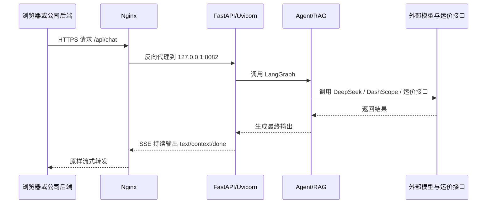

# freight-agent 阿里云 Linux 部署与访问手册

## 1. 这份文档解决什么问题

这份文档不是单纯给一组命令，而是把这套项目从本地跑通，到部署到阿里云 ECS，再到被别的服务器调用、被浏览器跨域访问的整条链路讲清楚。

你可以把它当成三件事的组合：

1. 项目怎么在 Linux 服务器上稳定跑起来。
2. 别的服务器怎么访问这个接口。
3. 浏览器跨域到底是什么，当前项目应该怎么处理。

---

## 2. 先给结论

如果你现在就要一个可执行、风险最低的部署方案，建议直接采用下面这套：

1. 操作系统选 `Ubuntu 22.04 LTS`。
2. 服务架构采用 `Nginx + Uvicorn + systemd`。
3. 对外只开放 `80/443/22`，不要把 `8082` 直接暴露到公网。
4. `Uvicorn` 只启动 `1` 个进程，不要上多 worker。
5. 代码和日志尽量放到 `500G` 数据盘，不要堆在系统盘。
6. RAG 文档里的 `4 个 .doc 文件` 先转成 `.docx`，再上 Linux。
7. 如果公司另一台服务器是“后端调后端”，它访问你的 API 不需要 CORS。
8. 如果公司另一台服务器承载的是“浏览器页面”，浏览器访问你的 API 才需要考虑 CORS，或者用反向代理绕过 CORS。

结合你当前机器配置：

- `8 核 32G` 跑当前这个项目是够的。
- `100G 系统盘 + 500G ESSD 数据盘` 是合理的，建议代码、知识库索引、日志放数据盘。
- `5Mbps` 能跑，但偏保守。如果未来会有明显并发、SSE 长连接、网页同时在线，后续建议升到 `10Mbps` 或更高。

---

## 3. 先看懂当前项目的部署约束

部署不能只看服务器，也要先看项目代码本身的约束。当前项目有 5 个和部署强相关的事实。

### 3.1 对外接口非常明确

当前项目入口在 `main.py`，外部只暴露两个接口：

- `POST /api/chat`
- `GET /health`

而且 `POST /api/chat` 返回的不是普通 JSON，而是 `SSE` 流式响应。

这意味着：

1. 反向代理必须支持长连接和流式转发。
2. 不能随便加会吞流的网关配置。
3. 调试时要用支持流式输出的命令，比如 `curl -N`。

### 3.2 当前代码已经启用了 CORS

`main.py` 已经加了 `CORSMiddleware`，而且当前是：

```python
allow_origins=["*"]
```

这表示：

- 现在浏览器跨域请求大概率能直接通过。
- 但这是“先跑通”的配置，不是“生产收口”的配置。
- 如果以后你要走 Cookie、凭证、会话态前端鉴权，`*` 方案就不够了。

### 3.3 当前服务是 SSE

`main.py` 里用的是 `EventSourceResponse(generate())`。

这意味着 Nginx 部署时必须关注：

- `proxy_buffering off;`
- 较长的 `proxy_read_timeout`
- 不要在中间层做响应缓存

### 3.4 当前项目有进程内会话状态

`main.py` 里有：

```python
SESSION_RUNTIME_STORE: dict[str, dict] = {}
```

这表示当前项目不是纯无状态服务。它会把一部分会话态保存在 Python 进程内存里。

部署含义非常直接：

1. 第一版不要上 `uvicorn --workers 4` 这种多 worker 方案。
2. 第一版不要上多台应用机做轮询负载均衡。
3. 否则同一个 `session_id` 可能落到不同进程，导致上下文丢失或错乱。

### 3.5 当前 RAG 文档里有 `.doc`，Linux 是重点风险

`rag/loaders.py` 的 `.doc` 解析逻辑用到了：

- `pythoncom`
- `win32com.client`
- `Microsoft Word`

当前 `data/docs/` 里实际也确实有 4 个 `.doc` 文件。

这意味着：

1. Linux 可以跑服务。
2. 但 Linux 不能直接按当前逻辑解析 `.doc` 文件建库。
3. 如果你不先处理 `.doc` 文件，部署到 Linux 后，RAG 建库环节会失败。

这是本次部署里最容易踩的坑之一。

---

## 4. 推荐的整体部署架构

下面这张图是这次最推荐的上线形态。

```mermaid
flowchart LR
    A[浏览器或公司前端页面] --> B[域名 / HTTPS]
    C[公司另一台后端服务器] --> B
    B --> D[Nginx 80/443]
    D --> E[Uvicorn 127.0.0.1:8082]
    E --> F[FastAPI main.py]
    F --> G[LangGraph / RAG / 运价工具]
    G --> H[DeepSeek API]
    G --> I[DashScope Embedding]
    G --> J[公司运价接口]
    F --> K[/data/chroma]
    F --> L[/data/cache]
    F --> M[/data/docs]
```

这张图要抓住 3 个重点：

1. 对外访问统一打到 `Nginx`，不是直接打 Python 端口。
2. Python 服务只监听本机 `127.0.0.1:8082`，更安全。
3. 浏览器访问、其他服务器调用、模型 API 调用，都是不同层次的问题，不要混在一起看。

---

## 5. 你需要先理解的几个概念

如果你对部署接触不多，先把下面几个概念建立起来，后面的命令就好理解了。

### 5.1 ECS 是什么

`ECS` 就是一台云上的 Linux 服务器。你可以把它理解成一台远程电脑。

你部署项目，本质上就是：

1. 把代码放到这台远程电脑上。
2. 安装 Python 和依赖。
3. 启动服务。
4. 用 Nginx 把外部请求转发给这个服务。

### 5.2 Nginx 是什么

`Nginx` 是对外的门面服务器。

它主要做这些事：

1. 监听 `80/443` 端口。
2. 接收外部请求。
3. 把请求转发到你真正的 Python 服务。
4. 处理 HTTPS 证书。
5. 控制哪些路径可以访问。

### 5.3 systemd 是什么

`systemd` 是 Linux 的服务管理器。

它负责：

1. 开机自动启动你的项目。
2. 项目崩了自动重启。
3. 提供标准日志查看方式。

### 5.4 安全组是什么

阿里云安全组相当于云层面的防火墙。

你在 Linux 里把端口开了，不代表公网就一定能访问；如果安全组没放行，也不通。

所以网络放通通常有两层：

1. 阿里云安全组
2. Linux 自身防火墙或 Nginx 监听配置

### 5.5 CORS 是什么

`CORS` 只和浏览器有关。

如果是：

- Java 后端调你的 API
- Python 脚本调你的 API
- 另一台服务器上的服务调你的 API

这都不是 CORS 问题。

只有下面这种情况才是 CORS：

- 用户在浏览器里打开 `https://portal.company.com`
- 页面里的 JS 去请求 `https://api.company.com/api/chat`

这时浏览器会做跨域校验。

---

## 6. 当前项目最推荐的访问方案

这里直接给推荐，不让你在多个方案里反复摇摆。

### 6.1 推荐方案 A：前端同源代理，尽量绕开 CORS

如果公司门户页所在服务器可控，最推荐：

1. 你的 AI API 部署在阿里云，例如 `https://api.company.com`
2. 公司门户服务器的 Nginx 再做代理，例如 `/freight-agent-api/`
3. 浏览器只请求门户自己的同源地址

这样做的好处是：

1. 浏览器感知不到跨域。
2. 线上问题更少。
3. CORS 复杂度最低。

### 6.2 推荐方案 B：直接跨域访问 API 域名

如果公司门户不能做代理，那就：

1. 前端页面直接请求 `https://api.company.com/api/chat`
2. 由 FastAPI CORS 中间件放行门户域名

当前项目已经是 `allow_origins=["*"]`，理论上能先跑通。

但生产环境更建议改成只允许实际域名，例如：

- `https://portal.company.com`
- `https://www.company.com`

### 6.3 推荐方案 C：公司后端服务器直接调 API

如果公司另一台服务器不是浏览器页面，而是后端服务，比如：

- Java 服务
- Python 服务
- Node 服务

那么它直接调用你的 `https://api.company.com/api/chat` 就行。

这种情况：

- 不需要 CORS
- 只需要网络能通
- 最好再加接口鉴权

---

## 7. 部署前的决策清单

在动服务器之前，先把下面几件事定下来。

### 7.1 操作系统选型

推荐直接选：

- `Ubuntu 22.04 LTS`

原因：

1. 社区资料多。
2. 对 Python/Nginx/systemd 支持成熟。
3. 新手排错成本低。

如果你已经选了 `Alibaba Cloud Linux 3`，也能部署，只是部分命令会从 `apt` 变成 `dnf`。

### 7.2 域名与 HTTPS

如果只是临时内测：

- 可以先用 `公网 IP + 端口` 调试。

如果要给公司门户长期接入：

- 建议准备一个专门的 API 域名，比如 `api.xxx.com`
- 再配 HTTPS

如果服务器在中国大陆并且要正式对公网提供网站/网页服务，通常还要关注备案要求。以阿里云官方说明为准，参考：

- https://help.aliyun.com/zh/icp-filing/basic-icp-service/support/what-scenarios-need-to-be-filed-in-aliyun

### 7.3 运价接口连通性

如果你的 `FREIGHT_API_BASE` 仍然是公司内网地址，例如 `192.168.x.x`，要先想清楚：

1. 阿里云 ECS 能不能访问这个内网地址。
2. 是否需要 VPN、专线、云企业网、或者改成公网可访问地址。

如果这个问题没解决，会出现典型现象：

1. `/health` 正常。
2. RAG 可能正常。
3. 运价查询失败或超时。

### 7.4 RAG 文档格式问题

当前最推荐做法是：

1. 在本地 Windows 机器上，把 4 个 `.doc` 转成 `.docx`
2. 替换 `data/docs/` 里的原文件
3. 本地先验证 RAG 建库能通过
4. 再部署到 Linux

不推荐第一版在 Linux 上硬扛 `.doc + pywin32 + Word COM` 兼容问题。

---

## 8. 推荐的服务器目录规划

建议把数据盘挂载到 `/data`，然后这样组织：

```text
/data
├── apps
│   └── freight-agent
├── logs
│   └── freight-agent
├── backups
│   └── freight-agent
└── runtime
    └── freight-agent
```

项目目录建议是：

```text
/data/apps/freight-agent
```

这么做的原因：

1. 系统盘只放系统。
2. 代码、日志、Chroma、缓存都放数据盘。
3. 后续扩容、备份、迁移更清晰。

---

## 9. 第一步：登录服务器并创建基础用户

如果你拿到的是阿里云 Linux 服务器，一般会先通过公网 IP 登录。

### 9.1 本地连接服务器

```bash
ssh root@<你的服务器公网IP>
```

第一次连接会提示确认指纹，输入 `yes`。

### 9.2 更新系统

Ubuntu:

```bash
apt update
apt upgrade -y
```

### 9.3 创建部署用户

不建议长期用 `root` 跑 Python 服务，建议单独建一个用户。

```bash
adduser appuser
usermod -aG sudo appuser
```

后面很多命令都建议切到这个用户执行：

```bash
su - appuser
```

---

## 10. 第二步：挂载 500G 数据盘

如果数据盘还没初始化，这是非常关键的一步。

阿里云官方 Linux 数据盘初始化文档可参考：

- https://help.aliyun.com/zh/ecs/user-guide/initialize-a-data-disk-whose-size-does-not-exceed-2-tib-on-a-linux-instance/

### 10.1 先看磁盘情况

```bash
lsblk -f
```

你通常会看到：

- 系统盘，比如 `/dev/vda`
- 数据盘，比如 `/dev/vdb`

一定先确认清楚，别把系统盘格式化了。

### 10.2 如果数据盘还是空盘，格式化为 ext4

下面假设数据盘是 `/dev/vdb`。如果你的实际设备名不同，要替换成实际值。

```bash
sudo mkfs.ext4 /dev/vdb
```

### 10.3 创建挂载点

```bash
sudo mkdir -p /data
```

### 10.4 挂载数据盘

```bash
sudo mount /dev/vdb /data
```

### 10.5 配置开机自动挂载

先拿到 UUID：

```bash
sudo blkid /dev/vdb
```

你会看到类似：

```text
/dev/vdb: UUID="xxxx-xxxx" TYPE="ext4"
```

然后编辑 `/etc/fstab`：

```bash
sudo cp /etc/fstab /etc/fstab.bak
sudo nano /etc/fstab
```

追加一行：

```text
UUID=xxxx-xxxx /data ext4 defaults,nofail 0 2
```

保存后验证：

```bash
sudo umount /data
sudo mount -a
df -h
```

如果 `df -h` 里能看到 `/data`，说明成功。

---

## 11. 第三步：安装 Python、Nginx 和基础工具

### 11.1 安装基础包

```bash
sudo apt update
sudo apt install -y python3 python3-pip python3-venv nginx curl unzip git
```

### 11.2 检查版本

```bash
python3 --version
pip3 --version
nginx -v
```

如果你明确需要 Python 3.11，而系统默认不是 3.11，可以额外安装对应版本后再创建虚拟环境。

---

## 12. 第四步：上传项目到服务器

如果当前项目不是标准 git 仓库，最简单的方式有两种。

### 12.1 方式 A：压缩包上传

适合你当前这个阶段，最直观。

本地把项目打包，然后上传到服务器，再解压到：

```text
/data/apps/freight-agent
```

### 12.2 方式 B：SCP 直接复制

如果你本地能用 `scp`，可以这样传：

```bash
scp -r freight-agent appuser@<公网IP>:/data/apps/
```

### 12.3 上传后设置权限

```bash
sudo mkdir -p /data/apps
sudo chown -R appuser:appuser /data/apps
sudo mkdir -p /data/logs/freight-agent
sudo chown -R appuser:appuser /data/logs/freight-agent
```

---

## 13. 第五步：处理 Linux 下的依赖与 `.doc` 风险

这是这次部署最关键的项目特有步骤。

### 13.1 为什么 Linux 下不能直接无脑 `pip install -r requirements.txt`

因为当前 `requirements.txt` 里有：

```text
pywin32
```

而且项目的 `rag/loaders.py` 确实在解析 `.doc` 时依赖：

- `pythoncom`
- `win32com.client`
- `Microsoft Word`

这些都是 Windows 路线，不适用于 Linux。

### 13.2 最推荐方案：先转文档，再在 Linux 安装无 pywin32 的依赖

推荐操作顺序：

1. 在本地 Windows 机器，把 4 个 `.doc` 文件全部转成 `.docx`
2. 用新 `.docx` 替换原文档
3. 确认 Linux 不再需要 `.doc` 解析逻辑
4. 在 Linux 上安装去掉 `pywin32` 的依赖

服务器上可以这样做：

```bash
cd /data/apps/freight-agent
python3 -m venv .venv
source .venv/bin/activate
python -m pip install --upgrade pip
grep -v '^pywin32$' requirements.txt > requirements.linux.txt
pip install -r requirements.linux.txt
```

### 13.3 备选方案：在 Windows 建好知识库，Linux 只跑服务

如果你暂时不想改文档格式，也可以这样：

1. 在 Windows 机器上完成 `python scripts/rebuild_kb.py`
2. 把生成好的 `data/chroma/` 和 `data/cache/` 上传到 Linux
3. Linux 只负责查询，不再负责解析 `.doc` 建库

这个方案也能用，但长期不如“统一转成 `.docx` 再在 Linux 重建”干净。

### 13.4 不建议的方案

不建议第一版尝试：

1. 在 Linux 上装 Wine
2. 在 Linux 上跑 Microsoft Word
3. 强行兼容 `win32com`

这会把部署复杂度放大很多，而且不稳定。

---

## 14. 第六步：创建虚拟环境并安装依赖

假设你已经上传代码并处理好 `.doc` 风险。

```bash
cd /data/apps/freight-agent
python3 -m venv .venv
source .venv/bin/activate
python -m pip install --upgrade pip
grep -v '^pywin32$' requirements.txt > requirements.linux.txt
pip install -r requirements.linux.txt
```

安装成功后可以简单检查：

```bash
python -c "import fastapi, uvicorn, chromadb; print('ok')"
```

---

## 15. 第七步：配置 `.env`

项目配置入口是 `config.py`，建议在项目根目录准备 `.env`。

在服务器上：

```bash
cd /data/apps/freight-agent
nano .env
```

建议模板如下：

```env
DEEPSEEK_API_KEY=your_deepseek_api_key
DEEPSEEK_BASE_URL=https://api.deepseek.com
DEEPSEEK_MODEL=deepseek-chat

FREIGHT_API_BASE=http://your-freight-api

NO_PROXY=192.168.0.0/16,127.0.0.1,localhost

DASHSCOPE_API_KEY=your_dashscope_api_key
EMBEDDING_MODEL=qwen3-vl-embedding

CHROMA_PERSIST_DIR=./data/chroma
CHROMA_COLLECTION_NAME=freight_knowledge

RAG_ENABLE_VECTOR_SEARCH=false
RAG_TOP_K_VECTOR=8
RAG_TOP_K_BM25=8
RAG_TOP_K_FINAL=4
RAG_CHUNK_SIZE=500
RAG_CHUNK_OVERLAP=100
RAG_ENABLE_RERANK=false
RAG_VECTOR_SEARCH_TIMEOUT_SECONDS=8
RAG_DOCS_DIR=./data/docs
```

### 15.1 首次上线的稳妥建议

建议第一版先这样：

1. `RAG_ENABLE_VECTOR_SEARCH=false`
2. 先让服务稳定起来
3. 再打开向量检索能力

这样做的目的是减少“是服务没起来，还是 Embedding 没通”的混淆。

---

## 16. 第八步：准备数据目录

确保下面这些目录存在：

```bash
cd /data/apps/freight-agent
mkdir -p data/chroma
mkdir -p data/cache
mkdir -p data/exports
mkdir -p data/docs
```

然后把知识库文档放入：

```text
/data/apps/freight-agent/data/docs
```

---

## 17. 第九步：初始化或重建知识库

### 17.1 如果你已经把 `.doc` 全部改成 `.docx`

直接在 Linux 上建库：

```bash
cd /data/apps/freight-agent
source .venv/bin/activate
python scripts/rebuild_kb.py
```

### 17.2 如果你是从 Windows 复制现成索引

只要保证这些目录已上传即可：

- `data/chroma/`
- `data/cache/`

### 17.3 建库完成后检查

通常你应该能看到：

- `data/chroma/`
- `data/cache/`
- `data/exports/`

如果这一步失败，优先看：

1. 文档格式是否还有 `.doc`
2. API key 是否配置正确
3. 服务器是否能访问外部模型 API

---

## 18. 第十步：先本机前台启动验证

不要一上来就配 Nginx 和 systemd。先直接起服务，确认应用本身能运行。

```bash
cd /data/apps/freight-agent
source .venv/bin/activate
python -m uvicorn main:app --host 127.0.0.1 --port 8082
```

这里故意先监听 `127.0.0.1`，表示只允许本机访问，方便先做本地验证。

### 18.1 健康检查

新开一个终端：

```bash
curl http://127.0.0.1:8082/health
```

预期返回：

```json
{"status":"ok"}
```

### 18.2 验证 SSE 聊天接口

```bash
curl -N http://127.0.0.1:8082/api/chat \
  -H "Content-Type: application/json" \
  -d '{"session_id":"deploy-test-001","message":"上海到洛杉矶空运多少钱","context":null}'
```

你应该看到持续流式输出，而不是一次性整块返回。

### 18.3 这一步通过，说明什么

如果这一步通过，说明：

1. Python 依赖没问题
2. `.env` 基本没问题
3. 项目能启动
4. SSE 没问题

这时再上 `systemd` 和 `Nginx` 才有意义。

---

## 19. 第十一步：用 systemd 托管服务

生产环境不要一直手工敲 `uvicorn`。

### 19.1 创建 service 文件

```bash
sudo nano /etc/systemd/system/freight-agent.service
```

写入：

```ini
[Unit]
Description=freight-agent FastAPI service
After=network.target

[Service]
User=appuser
Group=appuser
WorkingDirectory=/data/apps/freight-agent
Environment=PYTHONUNBUFFERED=1
ExecStart=/data/apps/freight-agent/.venv/bin/python -m uvicorn main:app --host 127.0.0.1 --port 8082
Restart=always
RestartSec=5

[Install]
WantedBy=multi-user.target
```

### 19.2 启动并设置开机自启

```bash
sudo systemctl daemon-reload
sudo systemctl enable freight-agent
sudo systemctl start freight-agent
```

### 19.3 查看状态

```bash
sudo systemctl status freight-agent
```

### 19.4 查看日志

```bash
sudo journalctl -u freight-agent -f
```

### 19.5 为什么这里不写多 worker

不要这样写：

```bash
uvicorn main:app --workers 4
```

原因不是“性能问题”，而是“会话状态问题”。

当前项目里 `SESSION_RUNTIME_STORE` 在进程内，多个 worker 会导致：

1. 同一个会话请求落到不同进程
2. 多轮上下文不一致
3. 报价结果分析链路可能异常

所以首版部署必须坚持单进程。

---

## 20. 第十二步：安装并配置 Nginx

### 20.1 启用 Nginx

```bash
sudo systemctl enable nginx
sudo systemctl start nginx
```

### 20.2 创建站点配置

```bash
sudo nano /etc/nginx/sites-available/freight-agent
```

写入：

```nginx
server {
    listen 80;
    server_name api.example.com;

    location / {
        proxy_pass http://127.0.0.1:8082;
        proxy_http_version 1.1;
        proxy_set_header Host $host;
        proxy_set_header X-Real-IP $remote_addr;
        proxy_set_header X-Forwarded-For $proxy_add_x_forwarded_for;
        proxy_set_header X-Forwarded-Proto $scheme;

        proxy_set_header Connection "";
        proxy_buffering off;
        proxy_cache off;
        proxy_read_timeout 3600s;
        proxy_send_timeout 3600s;
        add_header X-Accel-Buffering no;
    }
}
```

这个配置的核心不是转发本身，而是 SSE 相关的几行：

- `proxy_buffering off;`
- `proxy_read_timeout 3600s;`
- `add_header X-Accel-Buffering no;`

### 20.3 启用站点

```bash
sudo ln -s /etc/nginx/sites-available/freight-agent /etc/nginx/sites-enabled/freight-agent
sudo nginx -t
sudo systemctl reload nginx
```

### 20.4 为什么不建议公网直连 8082

因为更推荐这样分层：

1. 公网只看到 `80/443`
2. Python 服务只在本机开放 `127.0.0.1:8082`
3. 所有对外策略都由 Nginx 统一管理

---

## 21. 第十三步：阿里云安全组与 Linux 防火墙

### 21.1 阿里云安全组建议

建议放行：

- `22/TCP`
- `80/TCP`
- `443/TCP`

不建议长期放行：

- `8082/TCP`

如果你临时调试要开放 `8082`，也建议只放你自己的固定 IP，不要对全网开放。

阿里云安全组官方说明可参考：

- https://help.aliyun.com/zh/ecs/user-guide/add-a-security-group-rule

### 21.2 Linux 本机防火墙

如果启用了 `ufw`，可以这样放行：

```bash
sudo ufw allow 22/tcp
sudo ufw allow 80/tcp
sudo ufw allow 443/tcp
sudo ufw enable
sudo ufw status
```

如果没启用 `ufw`，那通常只要安全组和 Nginx 配置正确也能工作。

---

## 22. 第十四步：配置 HTTPS

如果前端页面要正式接入，建议尽快上 HTTPS。

### 22.1 为什么 HTTPS 很重要

原因有 3 个：

1. 浏览器对跨域和安全策略对 HTTPS 更友好。
2. 公司门户接入时通常默认要求 HTTPS。
3. 外部 API 调用更规范。

### 22.2 常见做法

常见有两种：

1. 用阿里云证书服务申请/上传证书，再挂到 Nginx。
2. 用 `certbot` 申请 Let’s Encrypt 证书。

如果你只是公司内测，先跑 HTTP 可以；正式接入门户时建议切 HTTPS。

---

## 23. 第十五步：从外部验证访问

### 23.1 先验证健康检查

在服务器外部执行：

```bash
curl http://api.example.com/health
```

或：

```bash
curl https://api.example.com/health
```

### 23.2 再验证 SSE

```bash
curl -N https://api.example.com/api/chat \
  -H "Content-Type: application/json" \
  -d '{"session_id":"remote-test-001","message":"上海到洛杉矶空运多少钱","context":null}'
```

如果你看到流式输出，说明：

1. Nginx 转发正常
2. SSE 没被缓存或缓冲打断
3. 应用对外访问基本没问题

---

## 24. 第十六步：另一台服务器如何调用这个接口

这里分 3 种场景讲，不要混。

### 24.1 场景 A：公司另一台“后端服务器”直接调用

例如另一台服务器上的：

- Java 服务
- Python 服务
- Node 服务

它直接调：

```text
https://api.example.com/api/chat
```

这种场景不需要 CORS。

它只需要：

1. 域名或 IP 能解析
2. 网络可达
3. 端口放通
4. 接口有鉴权的话带上鉴权

### 24.2 场景 B：公司另一台服务器承载的是“浏览器页面”

例如：

- 门户站前端页面在 `https://portal.company.com`
- AI API 在 `https://api.company.com`

那么浏览器发起请求时就是跨域。

这时有两种做法：

1. 让 API 后端显式允许 `portal.company.com`
2. 让门户服务器自己做代理，变成同源调用

### 24.3 场景 C：公司另一台服务器先做代理再给浏览器用

这是最推荐的浏览器接入方式。

门户服务器 Nginx 可以配置：

```nginx
location /freight-agent-api/ {
    proxy_pass https://api.example.com/;
    proxy_http_version 1.1;
    proxy_set_header Host api.example.com;
    proxy_set_header X-Real-IP $remote_addr;
    proxy_set_header X-Forwarded-For $proxy_add_x_forwarded_for;
    proxy_buffering off;
    proxy_read_timeout 3600s;
}
```

然后浏览器只请求：

```text
/freight-agent-api/api/chat
```

这样浏览器认为自己请求的还是 `portal.company.com`，自然就没有跨域。

---

## 25. CORS 到底该怎么理解

很多人一提“跨域”就把所有访问问题都归到 CORS，其实不对。

### 25.1 下面这些不是 CORS

- 另一台服务器 `curl` 调你的 API
- Java 服务调用你的 API
- Python 脚本调用你的 API
- Postman 调你的 API

这些如果失败，优先查：

1. DNS
2. 网络
3. 端口
4. 证书
5. 鉴权

### 25.2 下面这些才是 CORS

- 浏览器页面所在域名和 API 域名不同
- JS 在浏览器里直接请求另一个域名的接口

### 25.3 当前项目的 CORS 现状

当前代码已经是：

```python
allow_origins=["*"]
allow_methods=["*"]
allow_headers=["*"]
```

这表示第一版“先跑通”通常没问题。

### 25.4 生产环境建议

如果正式给公司前端用，更建议收敛成实际域名，例如：

```text
https://portal.company.com
https://www.company.com
```

原因：

1. 安全边界更清晰
2. 排查来源更方便
3. 避免任何网站都能在浏览器里调用你的 API

### 25.5 一个容易误解的点

如果你前端以后要带 Cookie 或凭证，`allow_origins=["*"]` 往往就不够。

不过就当前项目而言，如果只是普通请求体和响应流，没有浏览器 Cookie 会话依赖，那么 `*` 可以先用来跑通。

---

## 26. 推荐的外部访问链路



这个链路要重点关注两件事：

1. `A -> N -> U` 这段必须保持流式，不要被缓冲。
2. `G -> X` 这段依赖外部网络连通性，任何一端不通都会体现在最终对话失败。

---

## 27. 生产环境的建议策略

### 27.1 先保守上线

建议首版这样做：

1. 单机
2. 单进程
3. Nginx 反代
4. HTTP 先打通，HTTPS 再补
5. RAG 先 BM25 或先用现成索引

### 27.2 不要首版就做的事情

不建议首版同时上：

1. 多 worker
2. 多实例负载均衡
3. 容器编排
4. Linux 兼容 `.doc` 黑科技
5. 前后端鉴权体系大改

因为你当前项目的关键目标不是“架构最炫”，而是“先稳定上线、先让接口可访问”。

---

## 28. 运维常用命令

### 28.1 查看服务状态

```bash
sudo systemctl status freight-agent
sudo systemctl status nginx
```

### 28.2 重启服务

```bash
sudo systemctl restart freight-agent
sudo systemctl reload nginx
```

### 28.3 查看服务日志

```bash
sudo journalctl -u freight-agent -f
sudo tail -f /var/log/nginx/access.log
sudo tail -f /var/log/nginx/error.log
```

### 28.4 重新建库

```bash
cd /data/apps/freight-agent
source .venv/bin/activate
python scripts/rebuild_kb.py
sudo systemctl restart freight-agent
```

### 28.5 更新代码后的标准动作

```bash
cd /data/apps/freight-agent
source .venv/bin/activate
pip install -r requirements.linux.txt
sudo systemctl restart freight-agent
```

---

## 29. 常见故障排查表

### 29.1 `/health` 通，但 `/api/chat` 没返回

优先排查：

1. 外部模型 API 是否可达
2. 运价接口是否可达
3. Nginx 是否把 SSE 缓冲掉了
4. 应用日志里是否有异常

### 29.2 浏览器报跨域错误

先问自己：

1. 是浏览器页面在调吗
2. 页面域名和 API 域名是否不同
3. 是直接跨域，还是可以改成同源代理

如果是浏览器跨域：

1. 先确认 FastAPI CORS 是否生效
2. 再确认 Nginx 没有吞掉相关响应头
3. 最后确认前端请求方式是否带了额外凭证

### 29.3 公司另一台服务器调用失败，但浏览器正常

这通常不是 CORS，而是：

1. 目标服务器网络不通
2. DNS 问题
3. 证书校验问题
4. 公司出口网络限制

### 29.4 RAG 建库失败

优先排查：

1. 是否还保留 `.doc` 文件
2. 是否错误安装了 Linux 不支持的 `pywin32`
3. DashScope API key 是否正确
4. 文档目录是否正确

### 29.5 运价查询失败但 RAG 正常

高概率是：

1. `FREIGHT_API_BASE` 指向公司内网地址
2. 阿里云 ECS 访问不到公司网络

这不是应用 bug，而是网络拓扑问题。

---

## 30. 本项目第一版上线的最终建议

如果按稳妥顺序执行，推荐是：

1. 先在 Windows 把 `.doc` 转成 `.docx`
2. 再上传代码到阿里云 Linux
3. 安装无 `pywin32` 的 Linux 依赖
4. 本地先跑通 `127.0.0.1:8082`
5. 再用 Nginx 对外暴露 `80/443`
6. 首版只跑单进程
7. 公司其他后端服务器直接走 HTTPS 调用
8. 浏览器接入优先走同源代理，次选直接跨域

---

## 31. 一份可直接照着执行的最短路径

如果你想先不研究原理，只想最快跑起来，可以按这个顺序做：

### 31.1 本地先处理文档

1. 把 `data/docs/` 里的 `.doc` 转成 `.docx`
2. 确保 Linux 不再依赖 `pywin32`

### 31.2 服务器准备

1. 创建 Ubuntu 22.04 ECS
2. 挂载 500G 数据盘到 `/data`
3. 安装 `python3 python3-venv nginx`

### 31.3 上传项目

1. 上传到 `/data/apps/freight-agent`
2. 创建虚拟环境
3. 生成 `requirements.linux.txt`
4. 安装依赖

### 31.4 初始化服务

1. 配置 `.env`
2. 执行 `python scripts/rebuild_kb.py`
3. 前台运行 `uvicorn`
4. 测试 `/health`
5. 测试 `/api/chat`

### 31.5 上线

1. 配 `systemd`
2. 配 `Nginx`
3. 开安全组 `22/80/443`
4. 配域名和 HTTPS
5. 从另一台服务器实际调用验证

---

## 32. 官方参考链接

下面这些链接适合你在实际部署时对照看：

- 阿里云 Linux 数据盘初始化
  - https://help.aliyun.com/zh/ecs/user-guide/initialize-a-data-disk-whose-size-does-not-exceed-2-tib-on-a-linux-instance/
- 阿里云安全组规则
  - https://help.aliyun.com/zh/ecs/user-guide/add-a-security-group-rule
- 阿里云备案场景说明
  - https://help.aliyun.com/zh/icp-filing/basic-icp-service/support/what-scenarios-need-to-be-filed-in-aliyun

---

## 33. 这份文档对应当前项目的核心事实摘要

为了避免部署时脱离代码现实，最后再把和部署最相关的代码事实压缩成一句话：

1. 项目入口是 `FastAPI + SSE`。
2. 当前 API 路径是 `/api/chat` 和 `/health`。
3. 当前已启用 `CORSMiddleware`，默认允许所有源。
4. 当前存在进程内 `SESSION_RUNTIME_STORE`，不适合多 worker。
5. 当前 `.doc` 文档解析依赖 Windows COM，不适合 Linux 原样建库。

只要你抓住这 5 个事实，这个项目的部署路径就不会偏。
